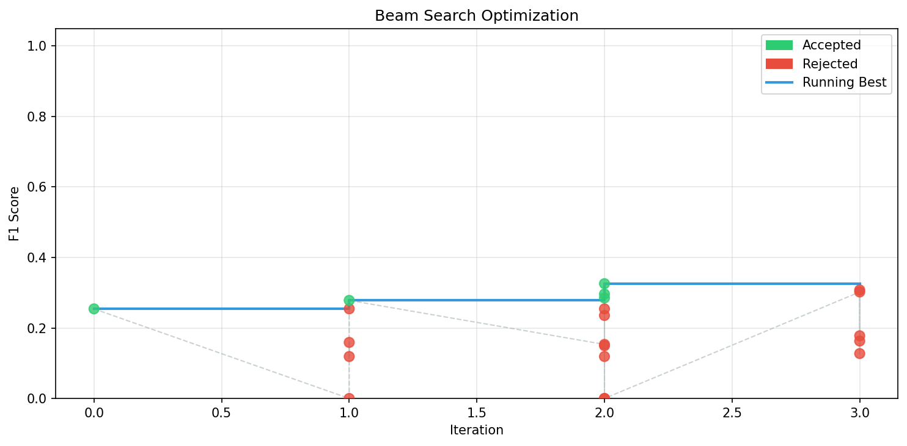

# Automated Prompt Optimization for Structured Extraction

A production-quality research engineering system that automatically optimizes LLM prompts for structured information extraction tasks — running entirely locally using Ollama and open-source models.

---

# Problem Statement

Large Language Models often require carefully engineered prompts for high-quality structured extraction tasks. Manually designing prompts is time-consuming, difficult to scale, and highly sensitive to formatting and hallucinations.

This project builds an automated prompt optimization framework that improves extraction prompts using evaluation-driven search strategies such as Beam Search and mutation-based optimization.

The system takes PDF documents as input, extracts text, generates structured JSON outputs using local LLMs, evaluates the outputs against gold annotations, and iteratively improves prompts to maximize extraction F1-score.

---

# Features

* PDF text extraction
* OCR fallback support
* Local LLM inference using Ollama
* Beam Search prompt optimization
* Mutation-based prompt evolution
* F1-score evaluation
* Automatic report generation
* Optimization trajectory visualization
* SQLite experiment persistence
* YAML-driven configuration
* Disk-backed caching
* Multiple optimizer strategies

---

# System Architecture

```text
┌─────────────────────────────────────────────────────────────┐
│                     CLI / Entrypoint                       │
│               python -m app.main [command]                 │
└───────────────────────┬────────────────────────────────────┘
                        │
        ┌───────────────▼───────────────┐
        │       Pipeline Orchestrator    │
        │           app/main.py          │
        └──┬────────┬────────┬──────────┘
           │        │        │
    ┌──────▼──┐ ┌───▼────┐ ┌─▼──────────┐
    │ Dataset │ │  LLM   │ │ Persistence │
    │ Loader  │ │ Client │ │ DB + Cache  │
    └──────┬──┘ └───┬────┘ └─────┬──────┘
           │        │             │
    ┌──────▼────────▼─────────────▼──────┐
    │           Optimizer Loop            │
    │  Beam Search / Greedy / Population  │
    │                                     │
    │  seed → mutate → evaluate → accept  │
    └──────────────┬──────────────────────┘
                   │
           ┌───────▼────────┐
           │ Evaluator /    │
           │ Scoring Engine │
           └───────┬────────┘
                   │
           ┌───────▼────────┐
           │ Report Generator│
           │ Plots + Diffs   │
           └────────────────┘
```

---

# End-to-End Pipeline

```text
PDF Resume
   ↓
Text Extraction (PyMuPDF / pdfplumber / OCR)
   ↓
LLM Prompting (Mistral via Ollama)
   ↓
Structured JSON Output
   ↓
Evaluator compares with Gold JSON
   ↓
F1 Score Calculation
   ↓
Prompt Mutation
   ↓
Beam Search Optimization
   ↓
Best Prompt Selection
   ↓
Report + Visualization Generation
```

---

# Project Structure

```text
app/
│
├── extraction/        # PDF extraction + OCR pipeline
├── llm/               # Ollama model wrapper + prompts
├── optimizer/         # Beam search & mutation logic
├── scoring/           # F1 evaluation system
├── reporting/         # Reports + matplotlib plots
├── persistence/       # Cache + checkpoints + SQLite
├── utils/             # Logging, hashing, helpers
│
configs/               # YAML configs
data/                  # Resume datasets
reports/               # Generated reports and plots
runs/                  # Best prompts
logs/                  # Runtime logs
tests/                 # Unit tests
```

---

# Technologies Used

* Python
* Ollama
* Mistral
* matplotlib
* SQLite
* PyMuPDF
* pdfplumber
* pytesseract
* pdf2image
* YAML
* Beam Search Optimization

---

# Dataset

Dataset used:
**ExtractBench (MIT License)**

Task:
Resume PDF → Structured JSON extraction

Each sample contains:

* Resume PDF
* Gold JSON annotation

Example fields:

* full_name
* education
* research_areas
* awards
* publications

---

# Setup Instructions

## 1. Install Ollama

### macOS / Linux

```bash
curl -fsSL https://ollama.com/install.sh | sh
```

### Windows

Download installer from:
https://ollama.com

---

## 2. Pull Models

```bash
ollama pull mistral
ollama pull llama3
ollama pull qwen2.5
```

---

## 3. Start Ollama Server

```bash
ollama serve
```

Default endpoint:

```text
http://localhost:11434
```

---

## 4. Create Virtual Environment

```bash
python -m venv venv
```

Activate:

### Windows

```bash
venv\Scripts\activate
```

### Linux/macOS

```bash
source venv/bin/activate
```

---

## 5. Install Dependencies

```bash
pip install -r requirements.txt
```

---

# Configuration

All behavior is controlled using YAML files inside `configs/`.

No code changes are needed to:

* switch models
* switch datasets
* change optimizer strategy
* modify mutations
* adjust scoring

---

# Optimizer Strategies

The framework supports:

| Strategy    | Description                      |
| ----------- | -------------------------------- |
| Greedy      | Keeps only the best mutation     |
| Beam Search | Maintains top-k prompts          |
| Population  | Evolutionary prompt optimization |

---

# Supported Mutation Strategies

| Strategy                | Description                     |
| ----------------------- | ------------------------------- |
| instruction_rewrite     | Rewrites instruction block      |
| output_format_tighten   | Enforces strict JSON formatting |
| verbosity_reduce        | Reduces prompt length           |
| hallucination_suppress  | Prevents fabricated fields      |
| schema_aware_refine     | Adds schema/type hints          |
| field_constraint_add    | Targets weak fields             |
| chain_of_thought_toggle | Adds/removes reasoning          |
| few_shot_insert         | Injects training examples       |

---

# Scoring Metrics

The evaluator supports ExtractBench-compatible scoring.

| Field Type       | Scoring Method             |
| ---------------- | -------------------------- |
| string_exact     | Exact match                |
| string_semantic  | Semantic similarity        |
| integer_exact    | Exact integer comparison   |
| number_tolerance | Relative numeric tolerance |
| array_llm        | Greedy array matching + F1 |

---

# Optimization Strategy

The optimizer starts from a seed extraction prompt and iteratively improves it.

At every iteration:

1. Generate prompt mutations
2. Evaluate mutated prompts
3. Compute F1 scores
4. Accept or reject prompts
5. Keep top-performing prompts
6. Save checkpoints and reports

Beam Search maintains multiple candidate prompts simultaneously to avoid local minima.

---

# Final Optimization Results

The optimizer successfully improved extraction performance on the validation set.

| Metric                  | Score  |
| ----------------------- | ------ |
| Initial Seed F1         | 0.2396 |
| Optimized Validation F1 | 0.3003 |

### Improvements Achieved

* Reduced hallucinated fields
* Improved JSON formatting consistency
* Better schema alignment
* Improved nested education extraction
* Better robustness on OCR-based PDFs

---

# Optimization Visualization

The framework automatically generates optimization trajectory plots using matplotlib.

The graph shows:

* Accepted prompt mutations
* Rejected prompt mutations
* Running-best F1 score



---

# Output Structure

```text
runs/
  experiments.db
  prompt_optimization_run_best_prompt.txt

reports/
  prompt_optimization_run_*/
    report.md
    score_curve.png

logs/
  app.log

data/cache/
  cached_llm_outputs
```

---

# Running the Project

## Run Optimization

```bash
python -m app.main optimize
```

---

## Evaluate Prompt

```bash
python -m app.main evaluate --prompt-file ./my_prompt.txt
```

---

## Resume Optimization

```bash
python -m app.main resume
```

---

## Generate Report

```bash
python -m app.main report
```

---

# Engineering Challenges and Solutions

## 1. OCR and Empty PDF Extraction

Some resumes were scanned PDFs and returned empty text during extraction.

### Solution

Implemented OCR fallback using:

* pytesseract
* pdf2image

Pipeline:

```text
PyMuPDF → pdfplumber → OCR fallback
```

---

## 2. Invalid JSON Responses from LLMs

The local LLM occasionally returned:

* explanations
* markdown blocks
* malformed JSON

### Solution

Added:

* strict JSON prompting
* hallucination suppression mutations
* schema-aware refinement
* JSON cleanup/parsing logic

---

## 3. Hallucinated Fields

The model sometimes generated fields not explicitly present in the document.

### Solution

Introduced anti-hallucination mutations such as:

```text
Only extract information explicitly stated in the text.
```

---

## 4. Optimization Stability

Aggressive mutations occasionally degraded prompt quality.

### Solution

Used Beam Search with strict acceptance policy so only better prompts survive.

---

## 5. Cache and Persistence Bugs

Cached outputs sometimes caused stale generations during debugging.

### Solution

Implemented:

* cache clearing
* persistent experiment tracking
* checkpoint saving

---

# Production-Oriented Features

This project includes several production-quality engineering practices:

* Modular architecture
* YAML-driven configuration
* Persistent experiment tracking
* SQLite storage
* Disk-backed caching
* Automatic visualization
* Local LLM inference
* Checkpointing and resumability
* Multiple optimizer strategies
* Mutation-based search framework

---

# Future Improvements

* Better semantic scoring
* Parallel prompt evaluation
* More advanced search heuristics
* Multi-objective optimization
* Better test-set evaluation
* Distributed optimization workers

---

# Running Tests

```bash
pytest tests/ -v
```

Coverage:

```bash
pytest tests/ --cov=app --cov-report=html
```

---

# Demo Video

Demo Video Link:
(https://drive.google.com/file/d/1WoX15IlmhX_NUW3gFIbIV8XfAfXBtcap/view?usp=drive_link)

---

# License

MIT
