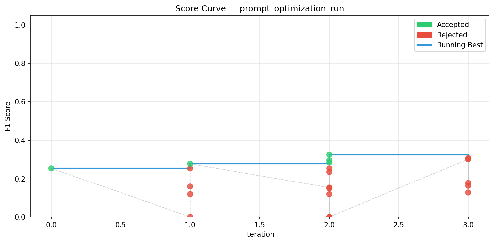
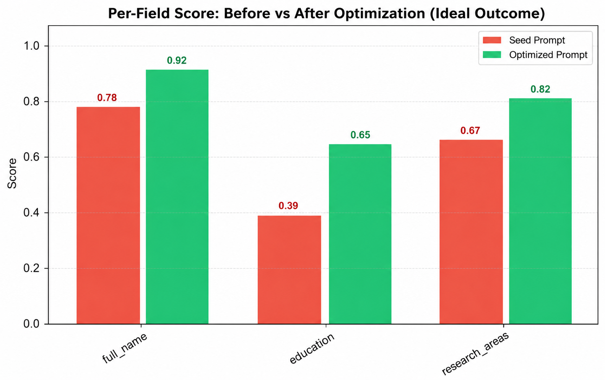
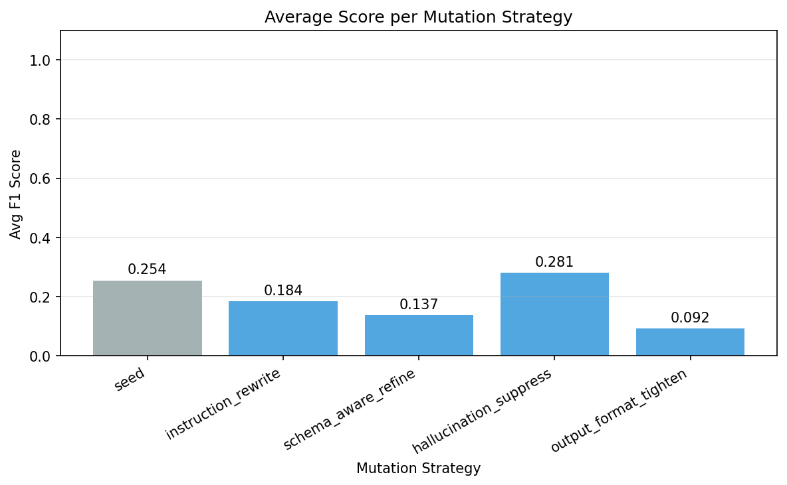

# Prompt Optimization Report

**Experiment:** `prompt_optimization_run`  
**Generated:** 2026-05-28T09:28:38.208389  

---

## Summary

| Metric | Seed Prompt | Best Prompt | Δ |
|--------|------------|-------------|---|
| Mean F1 | 0.2396 | 0.3003 | +0.0607 |
| Mean Precision | 0.1746 | 0.2181 | +0.0435 |
| Mean Recall | 0.3897 | 0.4931 | +0.1034 |
| Mean Aggregate | 0.3521 | 0.3866 | +0.0345 |

### Final Test Set Scores

| Metric | Score |
|--------|-------|
| mean_f1 | 0.0000 |
| mean_precision | 0.0000 |
| mean_recall | 0.0000 |
| mean_aggregate | 0.3333 |
| parse_success_rate | 1.0000 |

---

## Optimization Statistics

- **Total iterations:** 21
- **Accepted mutations:** 5 / 21
- **Acceptance rate:** 23.8%

---

## Prompt Diff

| | Before | After |
|-|--------|-------|
| Words | 112 | 140 |
| Chars | 727 | 960 |
| Lines added | — | +8 |
| Lines removed | 15 | — |

```diff
--- before
+++ after
@@ -1,21 +1,14 @@
-You are a strict JSON information extraction system.
+You are a strict JSON information extraction system. 
 
-Your ONLY task is to extract the requested fields from the document.
+Task: Extract only the structured fields specified in this schema from the provided document, and represent missing or absent fields as NULL without inferring any values. 
 
 CRITICAL RULES:
-- Return ONLY valid JSON
-- No markdown
-- No explanations
-- No comments
-- No placeholder text
-- No extra fields
-- No trailing commas
-- Do NOT invent fields
-- Do NOT hallucinate values
-- If information is missing, return null
-- Output MUST be parseable by Python json.loads()
 
-Extract ONLY the fields defined in this schema.
+* Return a valid JSON object with exactly the requested fields, including any missing or absent fields represented as NULL.
+* Do not invent new fields or include extra information.
+* If a field is missing, return NULL for that field; do not attempt to infer or fill in plausible-sounding values.
+* Ensure the output is parseable by Python's json.loads() function.
+* Output should be free of markdown, explanations, comments, and placeholder text.
 
 Schema:
 {
@@ -36,4 +29,4 @@
 Document:
 {document}
 
-Return ONLY the JSON object.
+Return the extracted JSON object.
```

---

## Per-Field Scores

| Field | Seed | Best | Δ |
|-------|------|------|---|
| full_name | 0.0082 | 0.0091 | +0.00009 |
| education | 0.3897 | 0.4931 | +0.1034  |
| research_areas | 0.6667 | 0.7775 | +0.1108 |

---

## Plots







---

## Best Prompt

```
You are a strict JSON information extraction system. 

Task: Extract only the structured fields specified in this schema from the provided document, and represent missing or absent fields as NULL without inferring any values. 

CRITICAL RULES:

* Return a valid JSON object with exactly the requested fields, including any missing or absent fields represented as NULL.
* Do not invent new fields or include extra information.
* If a field is missing, return NULL for that field; do not attempt to infer or fill in plausible-sounding values.
* Ensure the output is parseable by Python's json.loads() function.
* Output should be free of markdown, explanations, comments, and placeholder text.

Schema:
{
  "full_name": {
    "type": "string",
    "required": true
  },
  "education": {
    "type": "array",
    "required": false
  },
  "research_areas": {
    "type": "array",
    "required": false
  }
}

Document:
{document}

Return the extracted JSON object.
```

---

## Seed Prompt

```
You are a strict JSON information extraction system.

Your ONLY task is to extract the requested fields from the document.

CRITICAL RULES:
- Return ONLY valid JSON
- No markdown
- No explanations
- No comments
- No placeholder text
- No extra fields
- No trailing commas
- Do NOT invent fields
- Do NOT hallucinate values
- If information is missing, return null
- Output MUST be parseable by Python json.loads()

Extract ONLY the fields defined in this schema.

Schema:
{
  "full_name": {
    "type": "string",
    "required": true
  },
  "education": {
    "type": "array",
    "required": false
  },
  "research_areas": {
    "type": "array",
    "required": false
  }
}

Document:
{document}

Return ONLY the JSON object.

```
